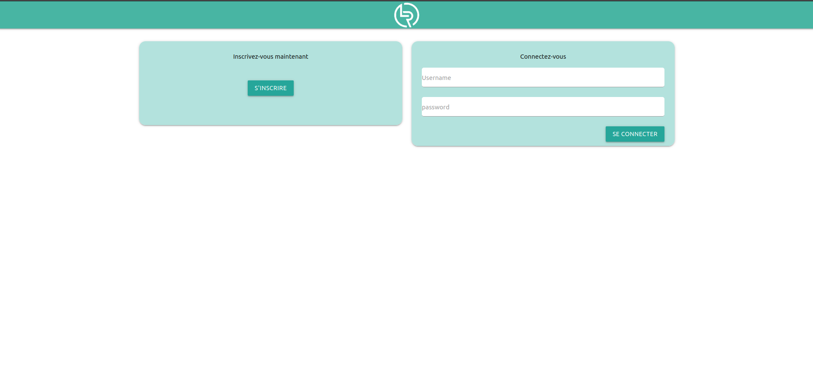
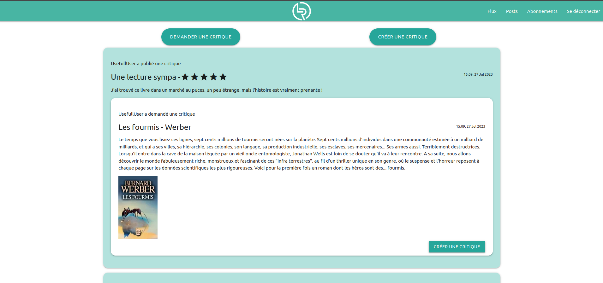

# Présentation
Le but de l'exercice est de développer une application web Python permettant à des utilisateurs de poster ou répondre à des critiques de livres ou d'articles.
Cette application est développée en utilisant le framework Django.

L'intégralité du projet est conforme aux critères de validation W3C et aux recommandations PEP8. 
Un rapport flake8-html est présent dans le repertoire 'flake-report'

# Fonctionnement 
Le projet repose sur trois applications principales : Main, Users et Feed.

Main : Cette application est responsable du squelette basique du projet ainsi que de la redirection de l'utilisateur entre les différents modules.  
Users : Cette application est responsable de la gestion des interactions entre serveur/utilisateurs et utilisateurs/utilisateurs.  
Feed : Cette application est responsable de la création et gestion des tickets et reviews postés par les utilisateurs.  

# Fonctionnalités
Depuis l'application, il est possible pour un utilisateur de : 
- S'inscrire ou se connecter
- S'abonner à d'autres utilisateurs (ou s'en désabonner)
- Voir le contenu créé par les utilisateurs suivis
- Créer des demandes de reviews
- Créer des reviews en réponse à des demandes 
- Voir, modifier ou supprimer le contenu créé par l'utilisateur authentifié 

# Demo
Une base de données démo est disponible dans le dépôt. 
Elle comprend 3 utilisateurs : 
- FirstUser : FUpassword
- TerryPratchettFan : TPFpassword
- UsefullUser : UUpassword

Et un compte administrateur :
- admin : password

Page de connexion :

Page d'accueil avec une review en réponse à un ticket:

# Utilisation

### Récupération du dépot 
- Téléchargez le contenu de ce dépot via le bouton dédié ou, dans un terminal : $ git clone https://github.com/AntoineArchy/LITReview.git

### Création de l'environnement virtuel
Ouvrez un terminal; 

- Pour ouvrir un terminal sur Windows, pressez les touches windows + r et entrez cmd.
- Sur Mac, pressez les touches command + espace et entrez "terminal".
- Sur Linux, vous pouvez ouvrir un terminal en pressant les touches Ctrl + Alt + T.

Placez-vous dans le dossier où vous souhaitez créer l'environnement (Pour plus de facilité aux étapes suivantes, il est recommandé de faire cette opération dans le dossier contenant le script à exécuter). Puis exécutez à présent la commande : 

`python -m venv env
`

Une fois fait, un nouveau dossier "env" devrait être créé dans le répertoire, il s'agit de votre environnement virtuel.

### Activation de l'environnement virtuel
Une fois la première étape réalisée, vous pouvez à présent activer votre environnement.
Pour ce faire, dans le dossier où l'environnement a été créé :

Ouvrez un terminal, rendez-vous au chemin d'installation de votre environnement puis exécutez la commande : 

- Windows (Cmd) : `env\Scripts\activate.bat`
- bash/zsh : `source venv/bin/activate`
- fish : `source venv/bin/activate.fish`
- csh/tcsh : `source venv/bin/activate.csh`
- PowerShell : `venv/bin/Activate.ps1`

Une fois fait, vous constatez que les lignes de votre cmd commencent à présent par "(env)", cela signifie que votre environnement est actif.

### Installation des dépendances
Dans le même terminal qu'à l'étape précédente :

`pip install -r requirements.txt`

### Execution 
Lors du premier lancement, il est important de suivre les étapes l'une après l'autre. Lors des exécutions suivantes, il est possible de réutiliser l'environnement créé précédemment. Pour ce faire, ne suivez que l'étape 2 (Activer l'environnement virtuel), vous pouvez alors simplement contrôler que les dépendances sont bien installées via la commande : `pip freeze`. Si toutes les dépendances sont bien présentes, il est possible de passer directement à l'exécution du script.

- Dans le terminal ayant servi à l'activation de l'environnement virtuel, exécutez la commande :
`python3 manage.py runserver`
- Dans le navigateur de votre choix, se rendre à l'adresse http://127.0.0.1:8000/
